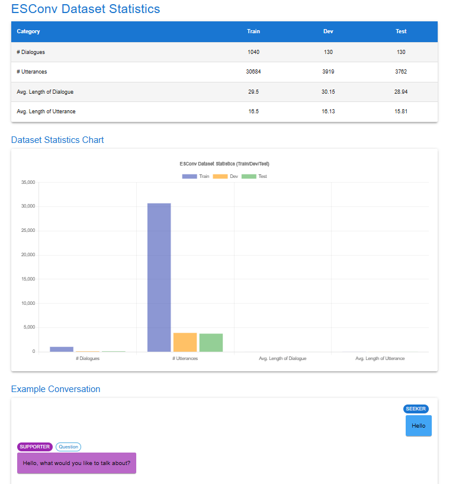
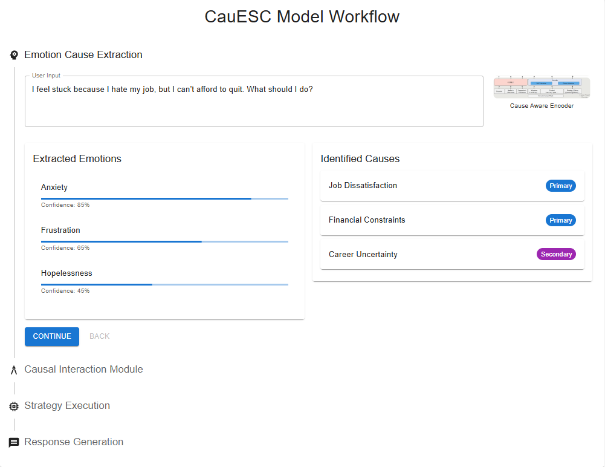
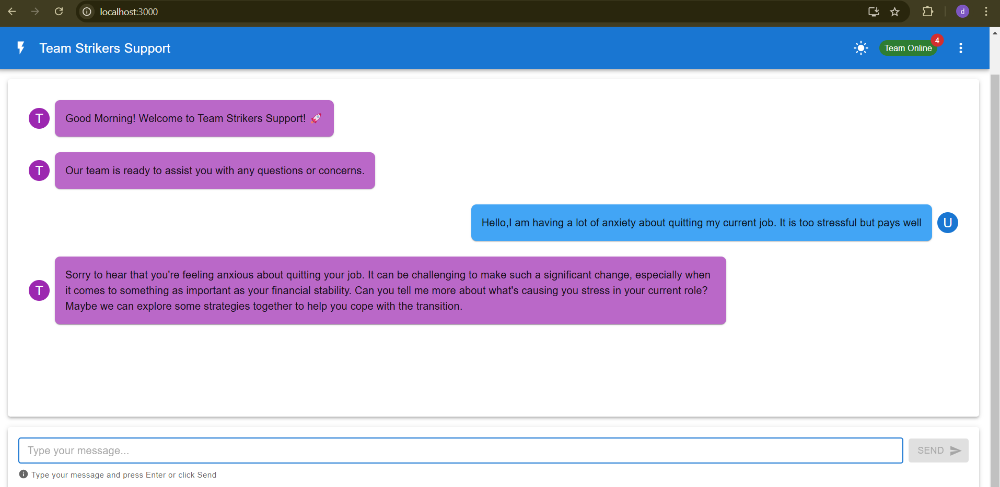

#SentiMate- Emotional-Support-Conversation-with-fine-grained-emotion-and-emotional-dynamics
---
## 👥 Authors


- **Shashank Pant**  - [GitHub: shashankpantiitbhilai](https://github.com/shashankpantiitbhilai)  


---

## 📊 GitHub Stats


---

## 🚀 Important Repository Info


- **Latest Release**: [v1.0.0](https://github.com/Akshatjamadagni/Emotional-Support-Conversation-with-fine-grained-emotion-and-emotional-dynamics/releases/tag/v1.0.0)  
- **License**:   
- **Build Status**:   
- **Contributors**:   
 

---

## 🚀 Repository Stats

  
  
  


## 🌟 Overview
CauESC is an advanced emotional support conversation model that integrates causal-aware encoders and multi-strategy executors to deliver fine-grained emotional responses. The project is built with a clear separation of backend, frontend, and model components, ensuring modularity and ease of development.
## Problem Statement:
To improve the quality of responses generated in dialogue systems tailored for emotional support a machine learning model known as CauESC model needs to be developed, which enhances conversations in emotional support contexts by recognizing emotional causes and effects. By capturing the emotional dynamics between the seeker and support provider, CauESC offers a comprehensive solution for understanding and addressing emotional distress.w

## Motivation/Faults in the previous similar models
Existing models for emotional support conversations face 2 major challenges:
- They ignore the emotional causes of distress.
- They focus solely on the seeker’s mental state without considering how emotions shift during interactions.
The CauESC model tackles these issues, capturing both emotional causes and effects, resulting in improved response generation.


## Objectives
The main objectives of this project are to:
1. Develop the CauESC model that analyzes both the causes and effects of emotions in support conversations.
2. Incorporate an attention mechanism to simulate human-like reasoning about emotional dynamics.
3. Propose a "multi-strategy" approach for emotional support dialogue generation.
4. Achieve state-of-the-art performance in strategy selection and response generation using the *ESConv dataset*.
---

## 📂 **Directory Structure**
Here's an organized breakdown of the project structure:
```
📦 Emotional-Support-Conversation-with-fine-grained-emotion-and-emotional-dynamics
├── 📂 Dataset/
│   ├── 📄 ESConv.json                   # Emotional support conversation dataset
│   └── 📘 README.md                     # Documentation for the Dataset directory
│
├── 📂 Backend/
│   ├── 📜 test.py                       # Script to test backend functionality
│
├── 📂 Frontend/
│   ├── 📂 public/                       # Public assets
│   │   └── ...
│   ├── 📂 src/
│   │   ├── 📂 Components/               # React components
│   │   │   ├── 📜 about.jsx             # About page component
│   │   │   ├── 📜 chatbot.jsx           # Chatbot interface component
│   │   │   ├── 📜 dataset.jsx           # Dataset visualization component
│   │   │   ├── 📜 navbar.jsx            # Navigation bar component
│   │   │   └── 📜 working.jsx           # Model functionality explanation component
│   │   ├── 📜 App.js                    # Main React application
│   │   ├── 📜 route.js                  # Frontend routing configuration
│   │   └── 📜 index.js                  # React DOM rendering entry point
│   └── 📘 README.md                     # Documentation for the Frontend directory
│
├── 📂 Model/
│   ├── 📂 Causal Interaction Module/
│   │   ├── 📜 layer_2_causal_encoder_module.py   # Cause-aware encoder logic
│   │   └── 📘 README.md                         # Documentation for the Causal Interaction Module
│   │
│   ├── 📂 Cause Aware Encoder/
│   │   ├── 📜 layer_1_encoder_module.py         # Main encoder module
│   │   ├── 📜 layer_1_comet_module.py           # COMET-based commonsense reasoning
│   │   └── 📘 README.md                         # Documentation for the Cause Aware Encoder
│   │
│   ├── 📂 Independent Integrated Strategy/
│   │   ├── 📜 layer_3_independent_integrated_strategy_executors.py # Multi-strategy response generation
│   │   └── 📘 README.md                                           # Documentation for Independent Integrated Strategy
│   │
│   └── 📘 README.md                      # Documentation for the Model directory
│
├── 📄 context_embeddings.pt             # Pre-trained context embeddings
├── 📄 situation_embeddings.pt           # Pre-trained situation embeddings
├── 📄 strategy_history_embeddings.pt    # Pre-trained strategy embeddings
├── 📓 CODE.ipynb                        # Jupyter notebook for model experimentation
├── 📋 requirements.txt                  # Python project dependencies
└── 📘 README.md                         # Project documentation

```
### 1. **Dataset**

  - `ESConv.json`: Processed emotional support conversation dataset with annotations for strategies, emotion types, and dialogues.

### 2. **Frontend**
Frontend implementation built with **ReactJS** to provide a user-friendly interface for interacting with the model.  
- **Structure**:
  - **`src/Components`**:  
    - **`about.jsx`**: Displays project information and purpose.  
    - **`chatbot.jsx`**: Chat interface for users to interact with the emotional support system.  
    - **`dataset.jsx`**: Visualizes the dataset used in the backend.  
    - **`navbar.jsx`**: Navigation bar for seamless page transitions.  
    - **`working.jsx`**: Explains how the model functions in detail.
  - **`App.js`**: Main app file integrating all components.  
  - **`route.js`**: Defines routes for navigating between different pages of the frontend.  
### 3. **Backend**
Contains server-side logic for handling API calls, managing datasets, and integrating the model.  

  - **`test.py`**: A script for testing model predictions and validating responses generated by the backend.  


### 3. **Model**
The core logic for emotional support conversation generation, divided into three main modules:  
- **Causal Interaction Module**:
  - **`layer_2_causal_encoder_module.py`**: Implements cause-aware encoding mechanisms.  
- **Cause Aware Encoder**:
  - **`layer_1_encoder_module.py`**: Handles general encoding and pre-processing of conversation inputs.  
  - **`layer_1_comet_module.py`**: Integrates COMET for commonsense reasoning.  
- **Independent Integrated Strategy**:
  - **`layer_3_independent_integrated_strategy_executors.py`**: Contains strategy-specific cross-attention executors for response generation.  
- **Pre-Trained Models**:
  - `context_embeddings.pt`: Contextual embeddings for input text.  
  - `situation_embeddings.pt`: Encodings for situational information.  
  - `strategy_history_embeddings.pt`: Pre-trained embeddings for strategy history.  

---

### 4. Dataset Structure


- Input text corpus
- Training/validation/test split
- Data cleaning and normalization steps
- Labeling and annotation schema*

### 5. Model Workflow


1. User input processing
2. Token embedding
3. Context encoding
4. Response generation
5. Post-processing and formatting
6. Response delivery*

### 6. User Interface

*Complete system architecture showing:
- Frontend React components
- API Gateway
- Backend services
- Model server
- Data flow between components*

## Features

- Interactive user interface for model interaction
- Real-time response generation with typing animation
- Multi-turn conversation support
- Context retention across messages
- Connection to Flask backend server
- Modern React components and practices


## 🚀 Installation
## Client
```bash
# Clone repository
git clone https://github.com/Akshatjamadagni/Emotional-Support-Conversation-with-fine-grained-emotion-and-emotional-dynamics.git
cd Emotional-Support-Conversation-with-fine-grained-emotion-and-emotional-dynamics

# Install backend dependencies
pip install -r requirements.txt


# Navigate to frontend folder
cd Frontend

# Install frontend dependencies
npm install

# Run frontend
npm start


```
## Server
```
# Start backend server
python3 Backend/test.py


```

### Prerequisites
bash
python >= 3.8
pytorch >= 1.8.0
transformers >= 4.5.0
numpy >= 1.19.2
comet-commonsense >= 1.0


## 📊 Model Components

### 1. Encoder Architecture
Input → Cause Aware Encoder
      → Emotion Cause Detection
      → Effect Acquisition (COMET)
      → Causal Interaction


### 2. Strategy Execution
Input Context
    ↓
Cause-Aware Context
    ↓
Strategy Distribution
    ↓
Multi-Executor Processing
    ↓
Integrated Response


## 🤝 Contributing

1. Fork the repository
2. Create feature branch
bash
git checkout -b feature/NewFeature

3. Commit changes
bash
git commit -m 'Add NewFeature'

4. Push to branch
bash
git push origin feature/NewFeature

5. Create Pull Request


## 📄 License
MIT License - see [LICENSE.md](License.md)


## 🙏 Acknowledgments
- BlenderBot team (Facebook AI)
- COMET researchers (Bosselut et al., 2019)
- RECCON dataset team (Poria et al., 2021)


## References
- Bosselut et al., 2019. [COMET: The Commonsense Transformers](https://arxiv.org/pdf/2401.17755).
- [GitHub Repository](https://github.com/Akshatjamadagni/Emotional-Support-Conversation-with-fine-grained-emotion-and-emotional-dynamics).

License: This project is licensed under the MIT License. See the [LICENSE](License) file for details.
# SentiMate
